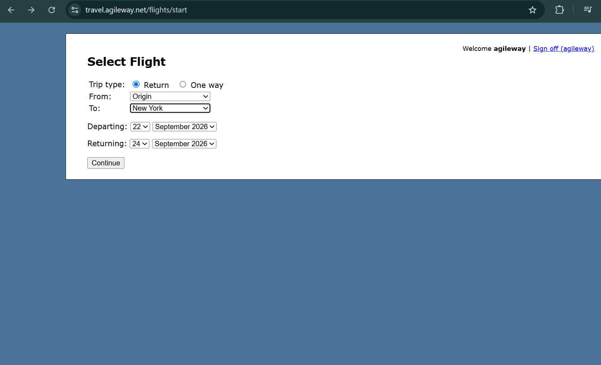

# Booking flight proceeds without validation when "From" or "To" fields are left unselected

**Related Jira issue:** FBA-2
**Priority:** Medium

## Steps to reproduce
1. Go to the Select Flight page
2. Choose type of the flight (Return or One way)
3. Leave the "From" field unselected (or leave "To" unselected)
4. Choose valid dates for the flight
5. Click Continue

## Expected
The system should display a validation error (e.g. "Please select departure city" / "Please select destination city") and prevent the user from proceeding until fields are filled.

## Actual
The booking proceeds to the next step.

## Severity
High

## Screenshot
