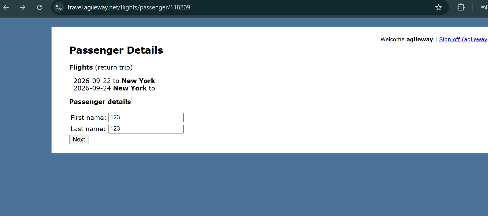

# Booking Flight → Passenger Details form accepts numeric values in First name and Last name fields without validation

**Related Jira issue:** FBA-3

**Priority:** Low

## Steps to reproduce
1. Navigate to Passenger Details form
2. Enter "123" in the First name field
3. Enter "123" in the Last name field
4. Click "Next"

## Expected
The system should display a validation error and prevent the user from proceeding.

## Actual
The First name and Last name fields accept numeric input without validation error, and the form allows the user to proceed by clicking "Next".

## Severity
Medium

## Screenshot
