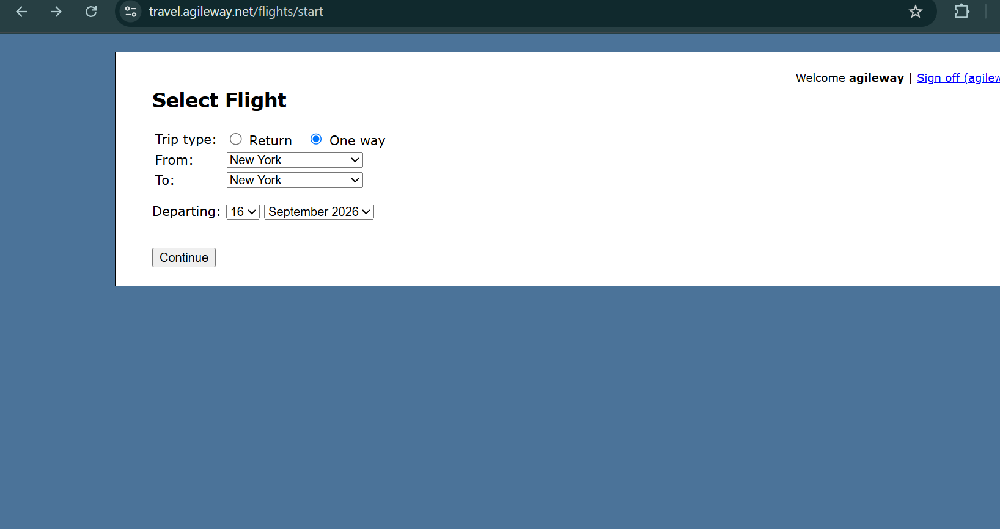

# Booking flight proceeds without validation when "From" and "To" destinations are the same

**Related Jira issue:** FBA-4
**Priority:** Medium

## Steps to reproduce
1. Navigate to Select Flight page
2. Select "One way" as trip type
3. Select "New York" in the "From" field
4. Select "New York" in the "To" field
5. Select a valid departing date
6. Click "Continue"

## Expected
The system should display a validation error and prevent the user from proceeding until a different destination is selected.

## Actual
The system allows the same destination to be selected in both the "From" and "To" fields with no validation error, and does not prevent the user from proceeding.

## Severity
High

## Screenshot
