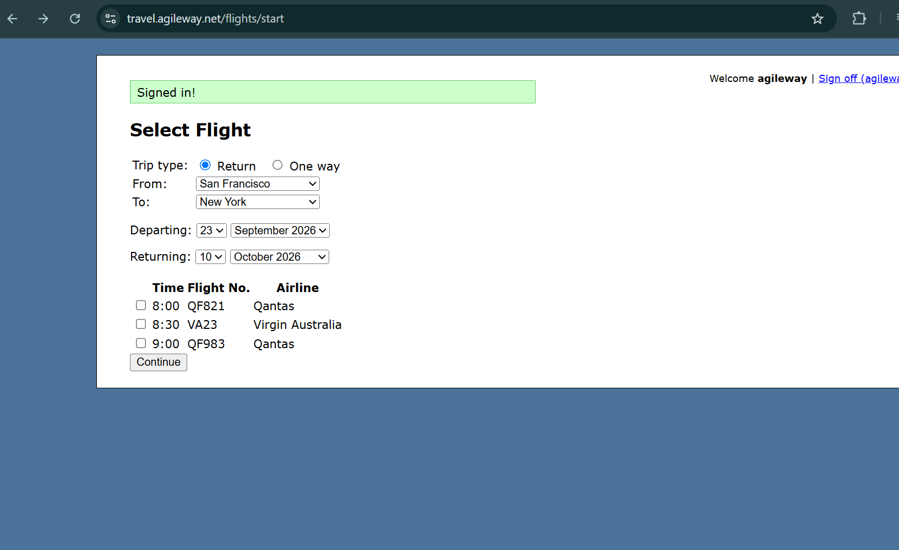

# Booking a flight proceeds when no flight is selected

**Related Jira issue:** FBA-5

**Priority:** High

## Steps to reproduce
1. Navigate to Select Flight page (travel.agileway.net)
2. Select "Return" as trip type
3. Select "San Francisco" in the "From" field
4. Select "New York" in the "To" field
5. Select valid Departing and Returning dates
6. Leave all flight checkboxes unchecked
7. Click "Continue"

## Expected
The system should display a validation error and prevent the user from proceeding to the next step.

## Actual
The system allows the user to proceed by clicking "Continue".

## Severity
High

## Screenshot
