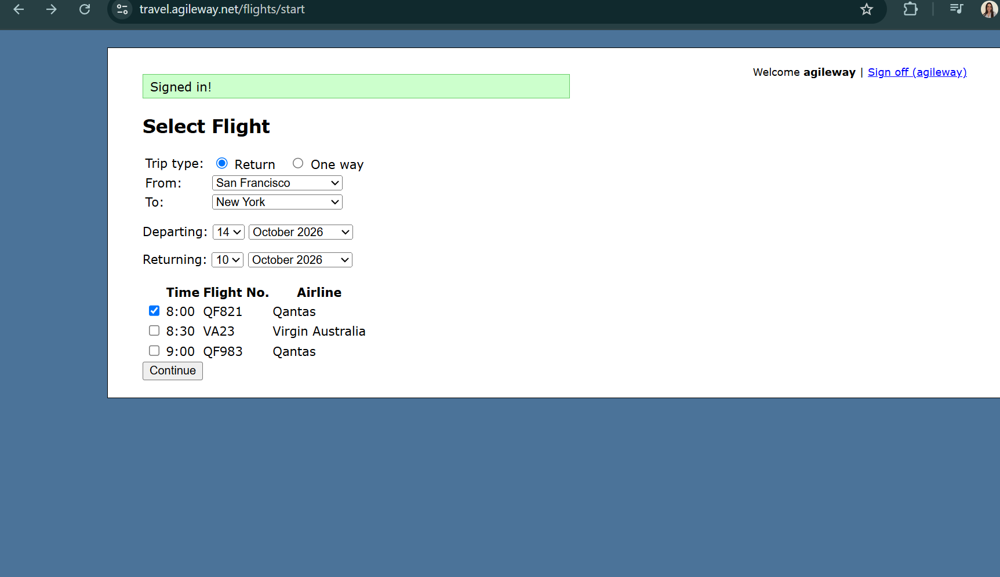

# Booking proceeds without validation when return date is before departure date

**Related Jira issue:** FBA-6

**Priority:** High

## Steps to reproduce
1. Go to the page [Agile Travel](https://travel.agileway.net/flights/start)
2. Select Return trip, From: San Francisco, To: New York
3. Departing: 14 Oct 2026, Returning: 10 Oct 2026
4. Select a flight
5. Click Continue

## Expected
Validation error preventing booking (return date before departure)

## Actual
No error shown, booking proceeds

## Severity
High

## Screenshot
