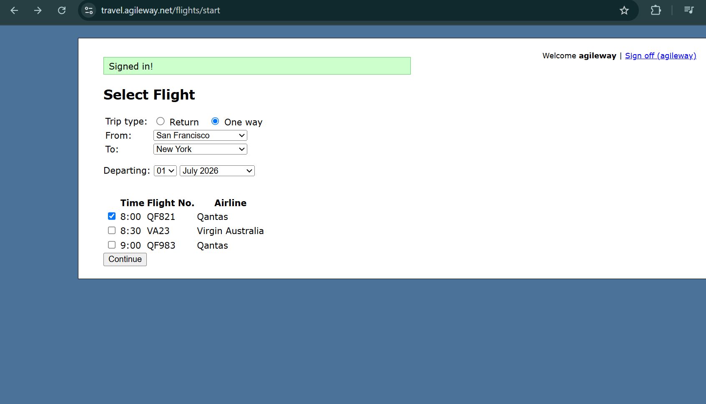

# Booking proceeds without validation when departure date is in the past

**Related Jira issue:** FBA-7

**Priority:** Medium

## Steps to reproduce
1. Navigate to [Agile Travel](http://travel.agileway.net/flights/start)
2. Select One way trip, From: San Francisco, To: New York
3. Departing: 01 July 2026 (past date, today is 14 Sep 2026)
4. Select a flight, click Continue

## Expected
Validation error preventing booking (past departure date)

## Actual
No error shown, booking proceeds

## Severity
Medium

## Screenshot
