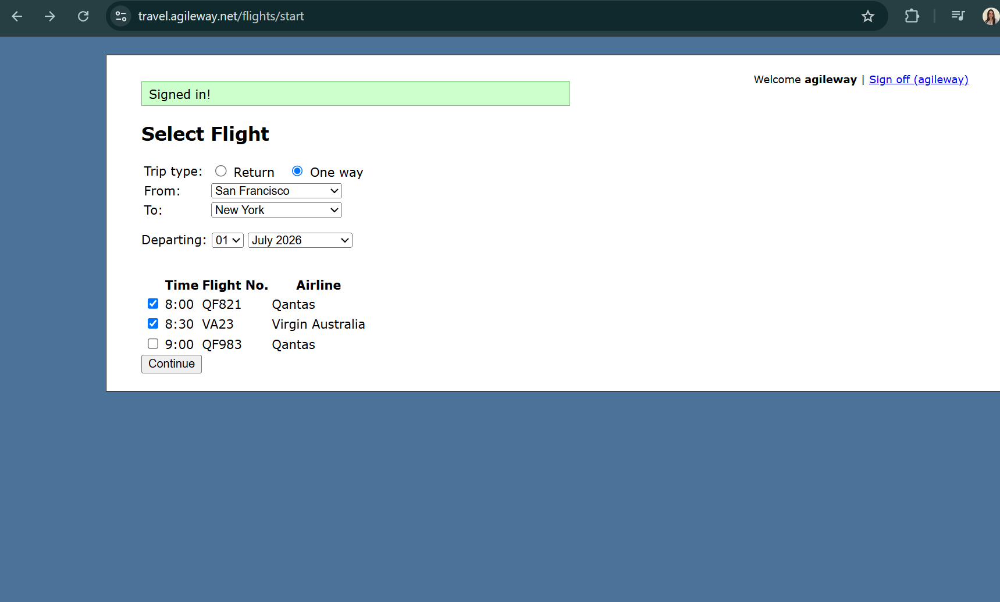

# Selecting a new flight does not deselect the previously selected one

**Related Jira issue:** FBA-9

**Priority:** Low

## Steps to reproduce
1. Navigate to [Agile Travel](http://travel.agileway.net/flights/start)
2. Select One way trip, From: San Francisco, To: New York
3. Check one flight
4. Check second flight

## Expected
Selecting the second flight should automatically deselect the first checked flight

## Actual
Both flights remain checked

## Severity
Low

## Screenshot
