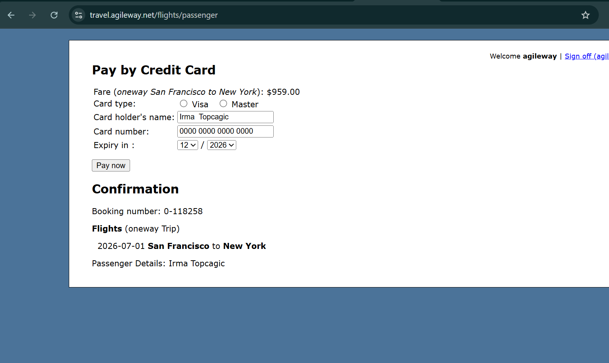

# Payment proceeds without validation when no card type is selected

**Related Jira issue:** FBA-10

**Priority:** High

## Steps to reproduce
1. Navigate to [travel.agileway.net/flights/passenger](http://travel.agileway.net/flights/passenger) (Pay by Credit Card page)
2. Leave Card type unselected (no Visa or Master)
3. Fill in Card holder's name, Card number, Expiry date
4. Click "Pay now"

## Expected
Validation error preventing payment (card type required)

## Actual
No error shown, payment proceeds to Confirmation page

## Severity
High

## Screenshot
