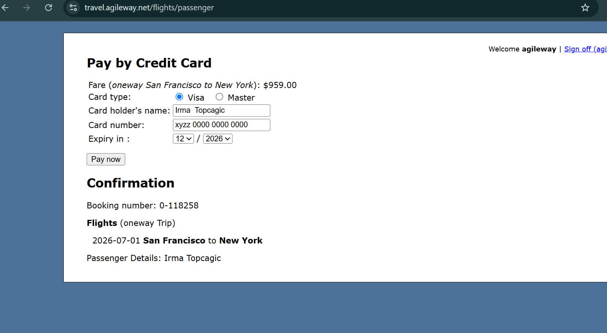

# Payment proceeds without validation when card number contains letters

**Related Jira issue:** FBA-12

**Priority:** Highest

## Steps to reproduce
1. Navigate to [travel.agileway.net/flights/passenger](http://travel.agileway.net/flights/passenger) (Pay by Credit Card page)
2. Select Visa as card type
3. Enter Card number: "xyzz 0000 0000 0000"
4. Fill in remaining valid fields, click "Pay now"

## Expected
Validation error preventing payment (card number must contain only digits)

## Actual
No error shown, payment proceeds to Confirmation page

## Severity
Highest

## Screenshot
