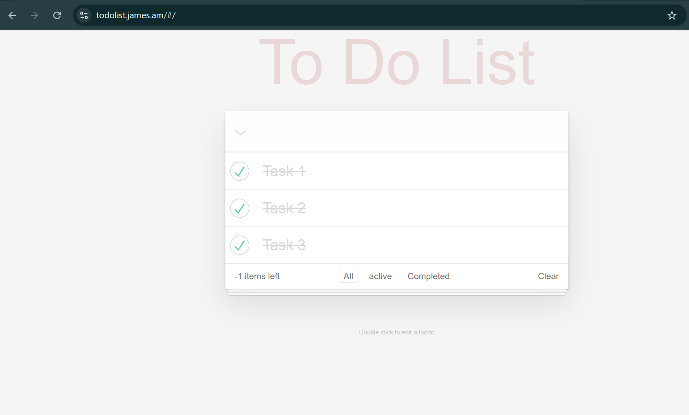

# Tasks count → Number of tasks left is always less than real number by 1

**Priority:** High

## Steps to reproduce
1. Add three tasks
2. Check three tasks as done
3. Observe the number of tasks left

## Expected
The number of tasks left is zero.

## Actual
The number of tasks left is -1.

## Priority
High

## Environment
- [x] Chrome
- [ ] Firefox
- [ ] Tablet
- [ ] Edge
- [ ] Safari

## Screenshot
