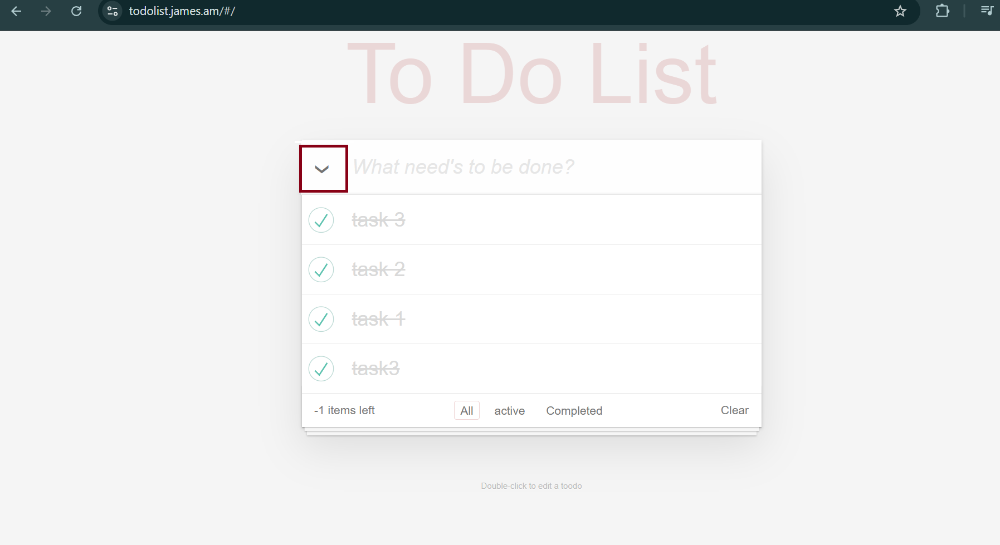

# Toggle-all arrow requires 3 clicks instead of 2 to switch task states (2nd click does nothing)

**Priority:** Medium

## Steps to reproduce
1. Open [To Do List](http://todolist.james.am) and add several tasks (all unchecked/active)
2. Click the toggle-all arrow once — all tasks become completed
3. Click the toggle-all arrow again (2nd click)
4. Click the toggle-all arrow a third time (3rd click)

## Expected
Each click on the toggle-all arrow should consistently switch between "all completed" and "all active" — clicking it should always toggle the state.

## Actual
1st click: all tasks become completed
2nd click: nothing happens (no state change)
3rd click: all tasks become active again

The 2nd click is non-functional / redundant.

## Priority
Medium

## Environment
- [x] Chrome
- [x] Firefox
- [ ] Tablet
- [x] Edge
- [ ] Safari

## Screenshot
